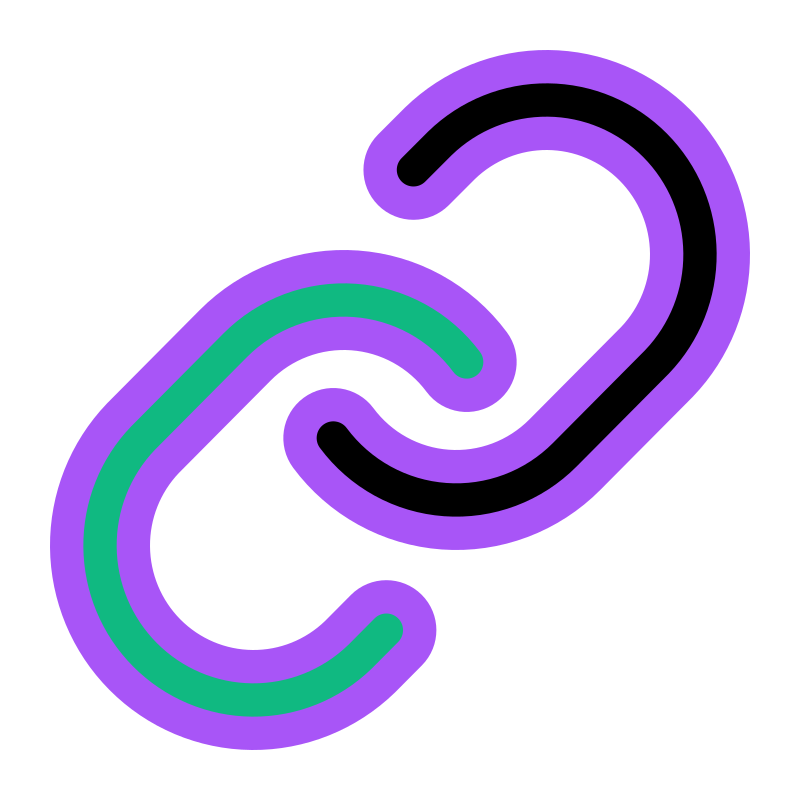

<h1 align="center">
    
</h1>

<h4 align="center"> 
	:heavy_check_mark: 🚀 Short Links 🚀 :heavy_check_mark:
</h4>

  <a href="#-projeto">Project</a>&nbsp;&nbsp;&nbsp;|&nbsp;&nbsp;&nbsp;
  <a href="#-como-executar">How to execute it</a>&nbsp;&nbsp;&nbsp;|&nbsp;&nbsp;&nbsp;
  <a href="#%EF%B8%8F-demonstração">Demonstration</a>&nbsp;&nbsp;&nbsp;|&nbsp;&nbsp;&nbsp;
  <a href="#-tecnologias">Technologies</a>&nbsp;&nbsp;&nbsp;|&nbsp;&nbsp;&nbsp;
  <a href="#memo-licença">License</a>

## 🈸 Project

Short links is a simple project to practice server creation with Node and Fastify

<b>Functionalities:</b>
- Get links
- Get metrics
- Go to URL and save access
- Create Links

## 🔧 How to execute it 
Go to the folder where you clone the project, open a terminal and follow these steps:
  Client:
  - 01 - cd client
  - 02 - npm i
  - 03 - npm run dev

  Server:
  - 01 - cd server
  - 02 - npm i
  - 03 - docker compose up -d
  - 04 - npm run setup
  - 05 - npm run dev

## 📽️ Demonstration

## 🚀 Technologies

The project was developed using these technologies:

- [React](https://reactjs.org)
- [Vite](https://vitejs.dev)
- [TailwindCSS](https://tailwindcss.com)
- [Typescript](https://www.typescriptlang.org)
- [Shadcn-UI](https://ui.shadcn.com)
- [Zod](https://zod.dev)
- [React Hook Form](https://react-hook-form.com)
- [Tanstack React Query](https://tanstack.com/query/latest)
- [Sonner](https://sonner.emilkowal.ski)
- [Node](https://nodejs.org/en)
- [Fastify](https://fastify.dev)
- [PostgreSQL](https://www.postgresql.org)
- [Redis](https://redis.io)
- [Docker](https://www.docker.com)

## :memo: License
This project is under the MIT License. See [LICENSE](LICENSE) for details.
